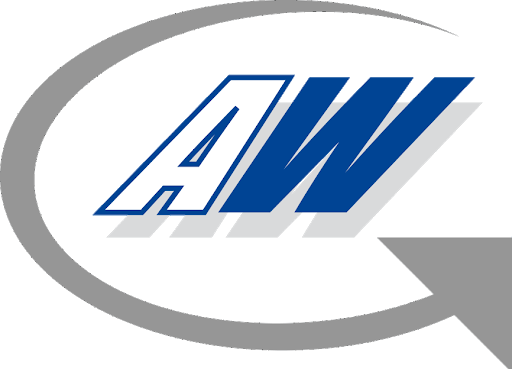

<a href="http://www.automationware.it/">
    
</a>

Authors: 
- [Mattia Dei Rossi](deirossi@automationware.it) - Automationware
- [Armando Selvija](selvija@automationware.it) - Automationware
- [Michele Tasca](tasca@automationware.it) - Automationware
# Aw robotics

This workspace has been developed and tested on `ros melodic`.

## Requirements
- ros melodic http://wiki.ros.org/melodic/Installation/Ubuntu
- docker https://docs.docker.com/engine/install/ubuntu/
- docker privileges https://docs.docker.com/engine/install/linux-postinstall/
- rt patch reccomended ( not mandatory ) 
- rt utils https://github.com/FraunhoferItalia/rt_utils ( mandatory for RoboVu )
- `sudo apt install ros-melodic-pilz*`
- pilz patch ( reccommended ) https://github.com/FraunhoferItalia/pilz_industrial_motion/commit/21536044cdc2e4fec0e72564b62ac6fba9c9ab3f

## Compile
```bash
cd ~/aw_robotics
catkin build
source devel/setup.bash # for each terminal launched
```

## Launch AwJoint and Awtube on simulation
possible combination of `joint_id` with `joint_size`: 
* awjoint1750   - J17
* awjoint2080   - J20 
* awjoint2580   - J25
* awjoint32100  - J32
* awjoint40100  - J40

### Run tests

### AwJoint expected behaviour


#### Command
```bash
roslaunch j_actuator_test test.launch sim:=true joint_id:=awjoint32100 joint_size:=J32
```

### Awtube expected behaviour
### Joint position Test


### Command
```bash
roslaunch awtube_test joint_position_test.launch sim:=true awtube_size:=M
```

### Target Pose test


### Command
```bash
roslaunch awtube_test pose_coords_test.launch sim:=true awtube_size:=M
```

### Cartesian coordinate test


### Command
```bash
roslaunch awtube_test cartesian_coords_test.launch sim:=true awtube_size:=M
```

## Launch AwJoint and Awtube on real hardware
AwJoints and AwTube currently are moved only in **CiA402** mode of operation:
1. *Cyclic synchronous position* mode -> _iface_:=position
2. *Cyclic synchronous velocity* mode -> _iface_:=velocity
3. *Cyclic synchronous torque* mode   -> _iface_:=effort

For 1. and 2. mode of operations `JointTrjectoryController` are available while for 3. only `JointGroupEffortController` is provided.
_iface_ has to be setted launching `bringup.launch`


### Setup:
- pull docker container
```bash
docker pull automationware/robovu
```
- make script executable inside aw_robotics workspace
```
cd ~/aw_robotics
chmod +x src/aw_driver/awtube_meta/scripts/robovu.sh
```
- configure realtime tuning script [rt_config](./src/aw_driver/rt_utils/README.md)

- run realtime tuning script inside rt_utils folder
```
sudo ./activate_all.sh
```

### Run tests
- Configure awtube_meta pkg like [awtube_meta configuration](./doc/configuration_awtube_meta.md)

### Launch RoboVu with
```bash
roslaunch awtube_meta bringup.launch
```

- Launch AwTube test 
```bash
roslaunch awtube_test joint_position_test.launch sim:=false awtube_size:=M
```
```bash
roslaunch awtube_test pose_coords_test.launch sim:=false awtube_size:=M
```
```bash
roslaunch awtube_test cartesian_coords_test.launch sim:=false awtube_size:=M
```

- Launch AwJoint test 
```
roslaunch j_actuator_test test.launch sim:=false joint_id:=awjoint32100 joint_size:=J32
```

### Test Effort Mode

To use `JointGroupEffortController` controller users have to type the desired target torque on the related topic. `**/robot_manager/arm/controller/effort/command` like the one shown in the following paragraph. The desired Target Torque is expressed in *Nm* ( referred to Input Shaft).

```
rostopic pub /awjoint40100/robot_manager/arm/controller/effort/command std_msgs/Float64MultiArray "layout:
  dim:
  - label: ''
    size: 1
    stride: 0
  data_offset: 0
data:
- 0" #TargetTorque --once
```
