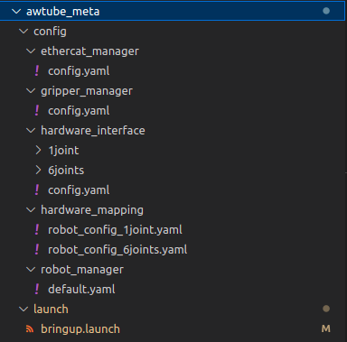

## awtube_meta pkg
This pkg is used to manage the configuration of ethercat client connected to the pc and ros controllers configuration.
These files **must** be changed in accoring to your pc and your J-Actuators

### Pkg organization
The `bringup.launch` file do the following steps:
- load `awtube_meta/config` parameters on `roscore`
- launch `RoboVu`



### Ethercat configuartion
file `awtube_meta/config/ethercat_manager/config.yaml`

```yaml
interface_name: eno2 # your Ethernet port
operation_mode: cyclic_sync_pos_mode
cpu_id: 3
frequency: 1000
clients_expected: 1
```
### Hardware configuartion
file `awtube_meta/config/hardware_mapping/robot_config_1joint.yaml`

```yaml
awjoint40100: # joint_id
  robot_config:
    arm:
      elements:
        id_0: Synapticon
      communication_manager:
        name: EthercatManager

```

#### AwJoint configuration
This is an example of using J40 ( joint_id: awjoint40100, joint_size: J40).
If you desired to change J-Actuator size, you have to change every field which has a comment next to it. For example if you want to use joint_id: awjoint1750, joint_size: J17
```yaml
J40: # becomes J17:
awjoint40100: # becomes awjoint1750:
```
You need to change the following files:

file `awtube_meta/config/hardware_interface/1joint_joint_limits.yaml`

```yaml
robot_manager: 
  joint_limits:
    J40: # joint_size
```

file `awtube_meta/config/hardware_interface/1joint_joint_offset.yaml`
```yaml
joint_offsets:
  J40: 0 # joint_size

joint_read_ratio:
  J40: 1.0 # joint_size
```

file `awtube_meta/config/hardware_interface/1joint_names.yaml`
```yaml
joint_names:
  - J40 # joint_size
```
file `awtube_meta/config/hardware_interface/1joint_posisiton_controllers.yaml`
```yaml
controller:
  state:
    type: joint_state_controller/JointStateController
    publish_rate: 100
  trajectory:
      type: position_controllers/JointTrajectoryController
      joints:
        - J40 # joint_size
      constraints:
          goal_time: 0.1
      stop_trajectory_duration: 0.35

  position:
    J40:
      type: position_controllers/JointPositionController
      joint: J40 # joint_size
      pid: {p: 100.0, i: 0.0, d: 0.0, i_clamp: 0}
```
file `awtube_meta/launch/bringup.launch`

```xml
<arg name="robot_name" default="awjoint40100" /> <!-- robot name is the joint_id -->
<arg name="urdf_path" default="$(find awjoint40100)/urdf/awjoint40100.urdf" /> <!-- load the correct urdf in according to joint_id -->
<arg name="subsystem" default="arm" />
<arg name="joints" default="1joint" />
<arg name="iface" default="position" />
<arg name="controller" default="trajectory" />
```

#### AwTube configuration
file `awtube_meta/launch/bringup.launch`

```xml
<!-- AwTube -->
<arg name="robot_name" default="awtube31210v1" />
<arg name="urdf_path" default="$(find awtube31210v1)/urdf/awtube31210v1.urdf" />
<arg name="subsystem" default="arm" />
<arg name="joints" default="6joints" />
<arg name="iface" default="position" />
<arg name="controller" default="trajectory" />
```